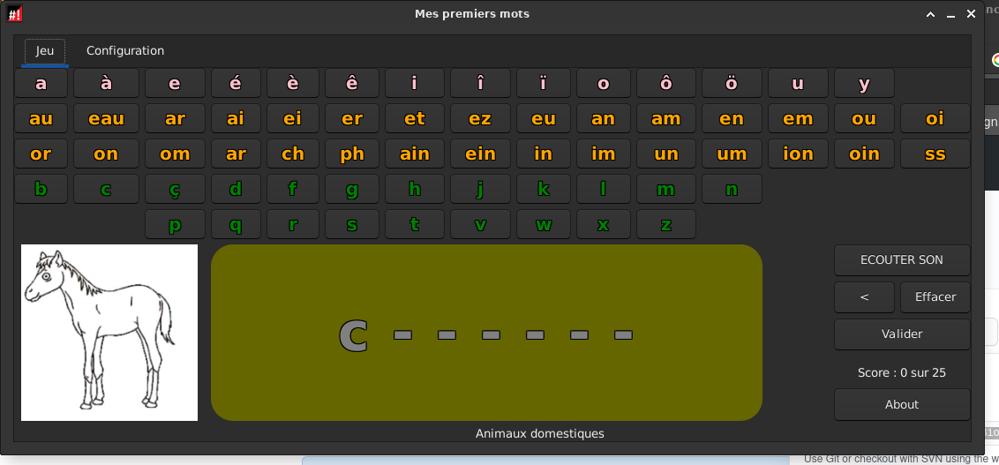
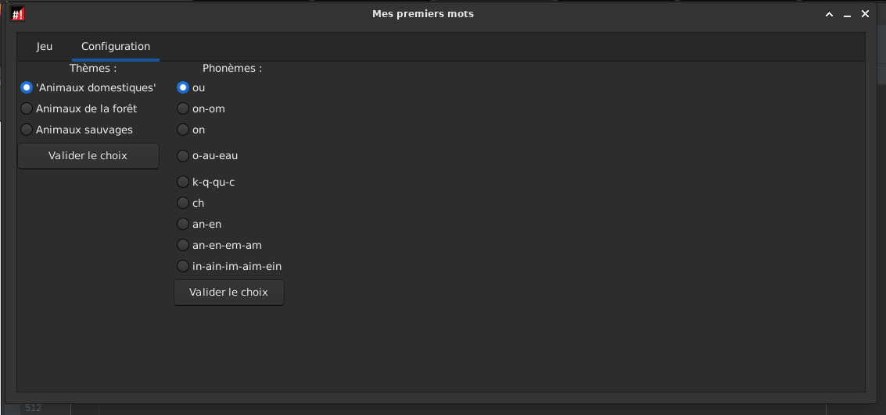
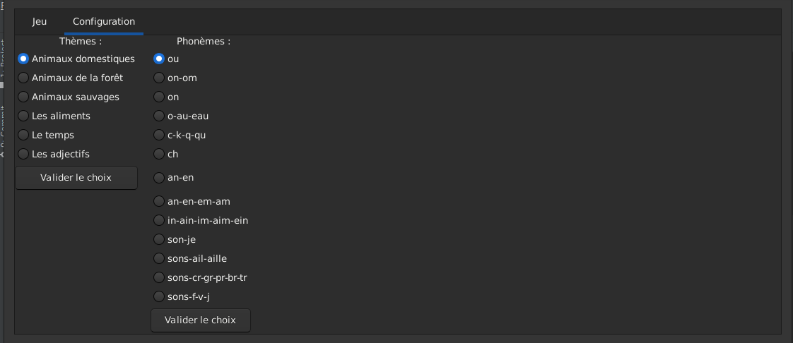
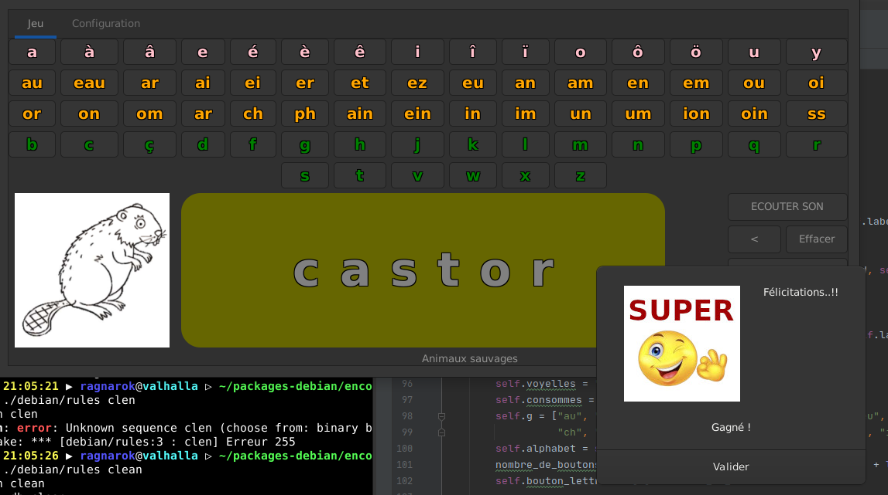
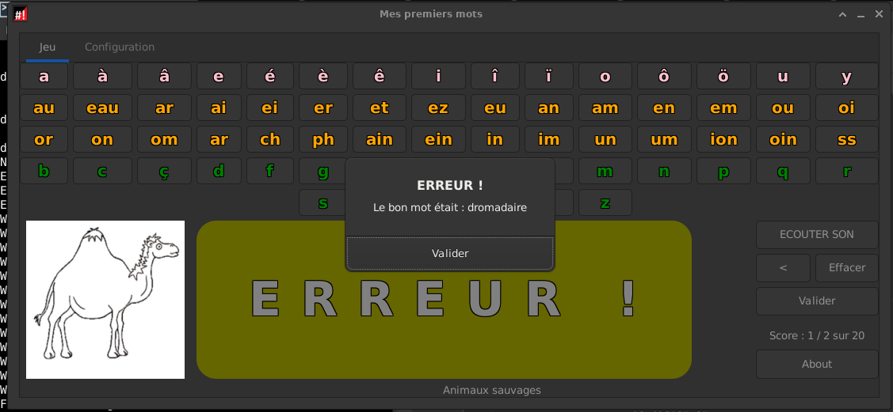

# Dictée de mots

## Quesako ?

Juste un utilitaire d'encodage pour apprentissage de l'écriture au cycle II ou EBP

## Actuellement
Clic gauche sur les lettres -> OK
Clic droit sur les lettres -> donne le phonème.
Base de données de mots et de sons associés
Rélaisation de cette base selon la **fréquence**, à adpater au cycle 2.

## Installation

# Depuis le git

```
git clone https://github.com/CyrilleBiot/encoder_mots.git
./source/encoder-mots.py
```


# Depuis pkg

```
wget https://github.com/CyrilleBiot/encoder_mots/raw/master/encoder-mots_1.0_all.deb
dpkg -i encoder-mots_1.0_all.deb
```

Desinstaller

```
dpkg -r encoder-mots
```

## Todo

Proposer des tips pour les lettres muettes, les consommes doubles...


## Screenshoots












## Changelog

encoder-mots (1.2) UNRELEASED; urgency=medium

  * Dialog box on error, add Phonèmes/graphèmes pattern, change score informations, fixed bugs
  * Others...

 -- Cyrille Biot <cyrille@cbiot.fr>  Thu, 04 Mar 2021 21:04:49 +0100

encoder-mots (1.0) unstable; urgency=medium

  * Initial release. (Closes: #XXXXXX)

 -- Cyrille Biot <cyrille@cbiot.fr>  Sun, 28 Feb 2021 13:40:01 +0100
